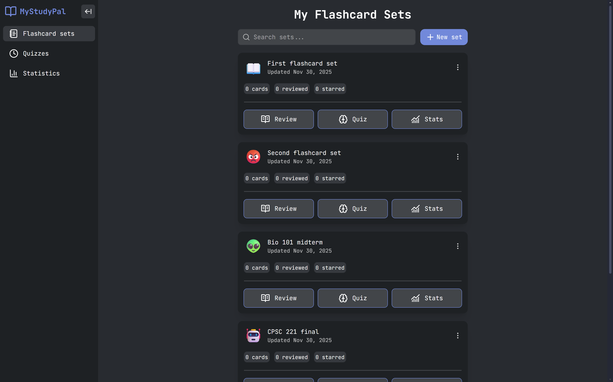
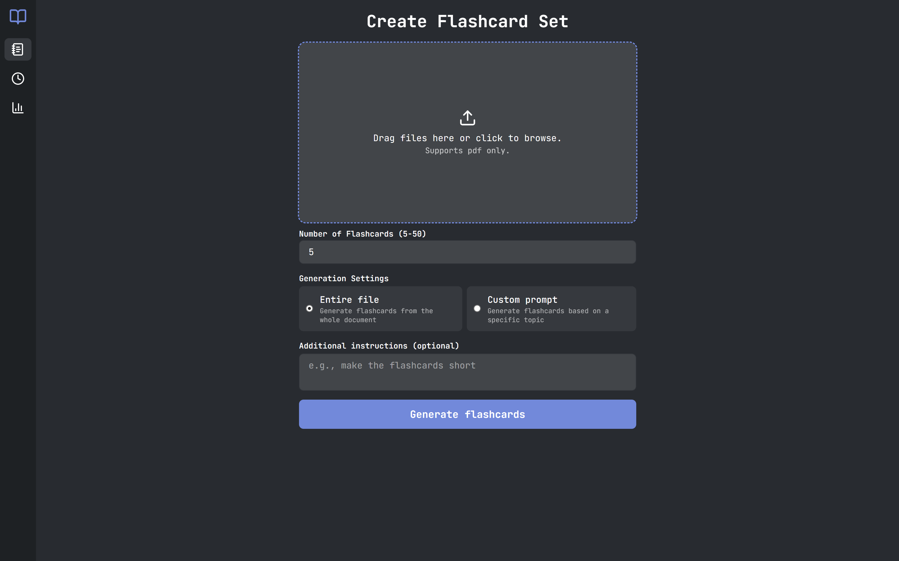
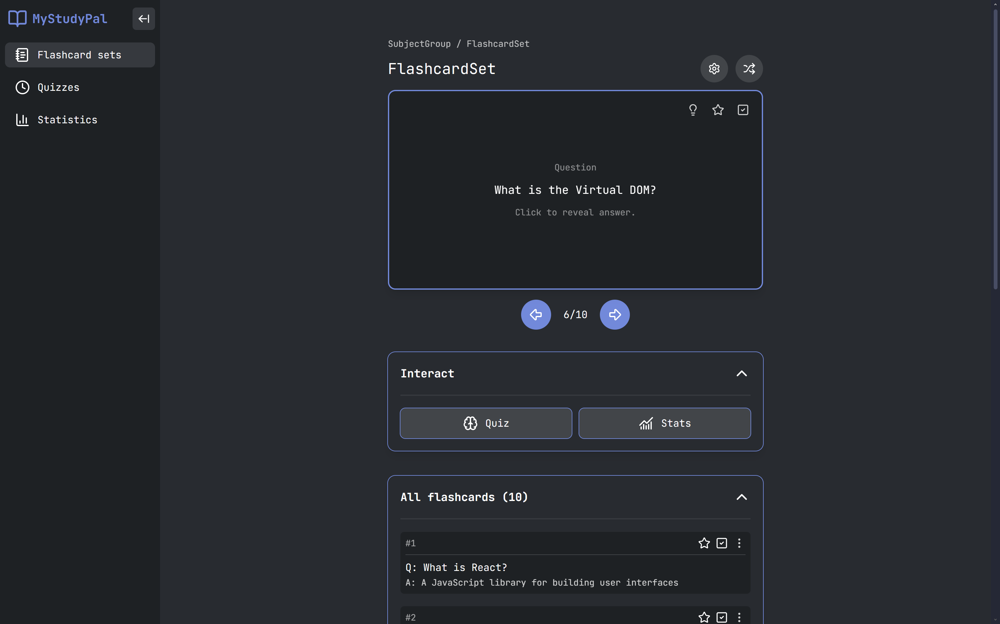
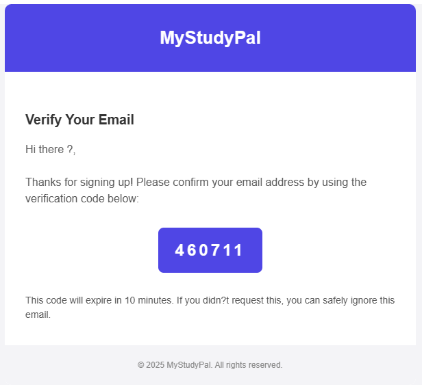
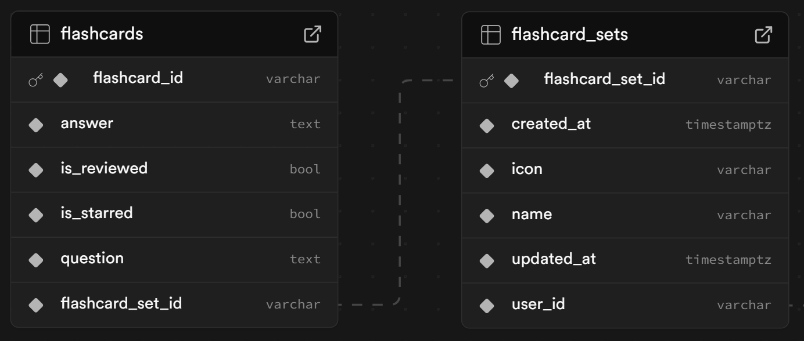
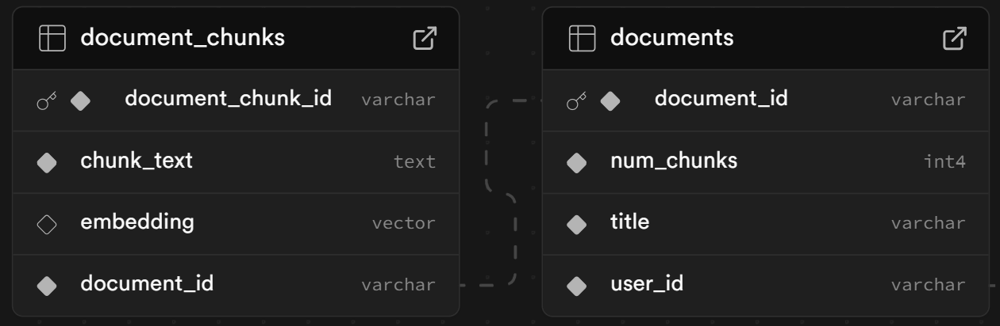

# 📖 MyStudyPal

MyStudyPal is a full-stack, AI-powered study platform designed to help students with their learning process. The application's core feature uses Google's Gemini AI to automatically generate interactive flashcard sets from uploaded study materials like lecture notes or textbooks. Students can use these documents to also generate quizzes to test themselves, and most importantly, track their learning progress to visually notice their learning improvements over time.

## ✨ Key Features

-   **AI-Powered Flashcard and Quiz Generation:** Automatically create comprehensive flashcard sets and quizzes from user-uploaded documents.
-   **Progress Tracking:** Track your progress to see how you have improved over time.
-   **Secure Authentication:** Support for both traditional email/password sign-up and OAuth2 with JWT tokens.
-   **Cloud-Native Backend:** A robust, scalable backend built with Java and Spring Boot.
-   **Modern Frontend:** A responsive and intuitive user interface built with Next.js, React, and TypeScript, optimized for mobile.

## 🛠️ Technology Stack

**Frontend:**

-   Next.js
-   React
-   TypeScript
-   Tailwind CSS

**Backend:**

-   Java
-   Spring Boot
-   Spring Security
-   PostgreSQL
-   Supabase
-   Google GenAI API
-   Apache PDFBox
-   Java Mail

## 🖼️ UI Showcase

| Home Page                                   | Signup Page                                   |
| ------------------------------------------- | --------------------------------------------- |
|  |  |

| Flashcard Sets Page                                   | Create New Set Page                                  |
| ----------------------------------------------------- | ---------------------------------------------------- |
|  |  |

| Flashcards page                                   |
| ------------------------------------------------- |
|  |

## 🔐 Authentication Pipeline

MyStudyPal provides a secure authentication system using Spring Security, that supports both standard email/password registration and OAuth2 for logging in with Google. Every request is authenticated using JWT access + refresh tokens for accessing secured endpoints. The following code shows how the filter chain works in the backend. Using this system ensures that the application is both secure and scalable in the future.

```java
// backend/src/main/java/com/sudimango/MyStudyPal/config/WebSecurityConfig.java

@Bean
public SecurityFilterChain securityFilterChain(HttpSecurity httpSecurity) throws Exception {
    httpSecurity
        .cors(cors -> cors.configurationSource(corsConfigurationSource()))
        .csrf(customizer -> customizer.disable())
        .authorizeHttpRequests(request ->
            request
                .requestMatchers("/api/public/**", "/api/auth/**", "/error").permitAll()
                .anyRequest().authenticated())
        .sessionManagement(customizer -> customizer.sessionCreationPolicy(SessionCreationPolicy.IF_REQUIRED))
        .oauth2Login(customizer -> customizer
            .loginPage("/oauth2/authorization/google")
            .userInfoEndpoint(info -> info.userService(customOAuth2UserService))
            .successHandler(oauth2LoginSuccessHandler)
            .failureHandler((request, response, exception) -> {
                String encodedMessage = URLEncoder.encode(exception.getMessage(), StandardCharsets.UTF_8);
                response.sendRedirect("http://localhost:3000/signup?error=" + encodedMessage);
            }))
        .addFilterBefore(jwtFilter, UsernamePasswordAuthenticationFilter.class);

    return httpSecurity.build();
}
```

### Verification Email

When signing up with email/password, a verification email is sent to the email that the user uses to sign up to the application. This email includes a randomly generated code that expires after a certain amount of time, sent in a visually-appealing HTML email format. This ensures that users can't blindly sign up using fake or fraudulent emails.

```java
// backend/src/main/java/com/sudimango/MyStudyPal/config/EmailConfiguration.java

@Bean
public JavaMailSender javaMailSender() {
    JavaMailSenderImpl mailSender = new JavaMailSenderImpl();
    mailSender.setHost("smtp.gmail.com");
    mailSender.setPort(587);
    mailSender.setUsername(email);
    mailSender.setPassword(password);

    Properties props = mailSender.getJavaMailProperties();
    props.put("mail.transport.protocol", "smtp");
    props.put("mail.smtp.auth", true);
    props.put("mail.smtp.starttls.enable", true);
    props.put("mail.debug", true);

    return mailSender;
}
```

```java
// backend/src/main/java/com/sudimango/MyStudyPal/service/EmailService.java

public void sendVerificationEmail(String to, String subject, String text) throws MessagingException {
    MimeMessage msg = mailSender.createMimeMessage();
    MimeMessageHelper helper = new MimeMessageHelper(msg, true);

    helper.setTo(to);
    helper.setSubject(subject);
    helper.setText(text, true);

    mailSender.send(msg);
}
```



## Flashcard Generation using RAG

The core feature of MyStudyPal is its ability to generate flashcards from user-uploaded documents, and make them persist so that users can use them for review, generate quizzes on them, and most importantly, track their progress. So far, only the flashcard generation exists. Users can upload thier documents and either generate flashcards on the entire document, or prompt the LLM to generate flashcards on a specific topic, which is where **Retrieval-Augmented Generation (RAG)** is used.

**Here's how it works:**

1.  **Document Upload & Text Extraction:** The user uploads a PDF document. The backend extracts the raw text content from the file.
2.  **Chunking:** The extracted text is split into smaller chunks through a custom page-based chunking with context overlap. This ensures that the context sent to the LLM is focused and relevant.
3.  **Vector Embeddings:** Each chunk is then converted into a vector embedding. This embedding is used to search for semantically meaningful context when the user/system prompts the LLM.
4.  **AI-Powered Generation:** The text chunks are sent to the Google GenAI model with a specific prompt instructing it to generate question-and-answer pairs suitable for flashcards.
5.  **Storing Flashcards:** The generated flashcards are saved to the database and associated with the user's account and the source document.

| Postgres flashcards and sets schema                                | Postgres documents and chunks schema                             |
| ------------------------------------------------------------------ | ---------------------------------------------------------------- |
|  |  |

```java
// backend/src/main/java/com/sudimango/MyStudyPal/component/GeminiClient.java

// Generates vector embedding given a string
private List<Float> generateEmbedding(String text) {
    EmbedContentConfig config = EmbedContentConfig.builder()
        .outputDimensionality(EMBEDDING_DIMENSIONS)
        .taskType("RETRIEVAL_DOCUMENT")
        .build();

    EmbedContentResponse response = this.client.models.embedContent(EMBEDDING_MODEL, text, config);

    List<Float> result = new ArrayList<>();
    if (response.embeddings().isPresent()) {
        List<ContentEmbedding> embeddings = response.embeddings().get();
        if (!embeddings.isEmpty()) {
            ContentEmbedding embedding = embeddings.get(0);
            if (embedding.values().isPresent()) {
                result.addAll(embedding.values().get());
            }
        }
    }
    return result;
}
```

### Why use RAG?

The decision to use RAG was initially made to reduce the number of tokens used to generate the flashcards. Initially, the idea was to strip the document's text and use the entire document as context. However, this was highly inefficient because it would be giving unnecessary context to the LLM and unnecessary increase the use of tokens, leading to the app being able to make only a few API calls to the Gemini API. The use of RAG enabled the app to only use relevant context from the documents, not only reducing the use of tokens but also significantly lowering hallucinations, which produced more precise and context-aware flashcards and quizzes.

### Chunking technique

MyStudyPal uses a custom text chunking technique to ensure that the retrieval of context is as accurate as possible. Initially, semantic chunking was to be used. However, due to complexitites such as the Gemini API allowing too few requests in the free tier, and local runtimes such as the ONNX Runtime not working as expected, I used a custom chunking technique instead.

**Here's how it works:**

1. **Split PDF document into pages:** The PDF is split into chunks based on its pages.
2. **Merge small pages:** To ensure that chunks aren't too small and to maintain sufficient context, very short pages are merged with their adjacent pages.
3. **Add context overlap between chunks:** To ensure continuity of context, a defined number of words from the end of a previous chunk are added to the beginning of the subsequent chunk.

```java
// backend/src/main/java/com/sudimango/MyStudyPal/component/DocumentProcessor.java

// Extract text page by page, merge small pages, and add overlap
private List<String> extractAndChunkPdf(String pdfPath) throws Exception {
    PDDocument document = Loader.loadPDF(new File(pdfPath));
    List<String> pageTexts = new ArrayList<>();

    PDFTextStripper stripper = new PDFTextStripper();
    int numPages = document.getNumberOfPages();

    // Extract all pages
    for (int pageNum = 1; pageNum <= numPages; pageNum++) {
        stripper.setStartPage(pageNum);
        stripper.setEndPage(pageNum);
        String pageText = stripper.getText(document).trim();

        if (!pageText.isEmpty()) {
            pageTexts.add(pageText);
        }
    }

    document.close();

    // If no valid pages, return whole document as one chunk
    if (pageTexts.isEmpty()) {
        String fullText = new PDFTextStripper().getText(Loader.loadPDF(new File(pdfPath)));
        return List.of(fullText);
    }

    // Merge small pages with adjacent pages
    List<String> mergedPages = mergeSmallPages(pageTexts, MIN_PAGE_WORDS);

    // Add overlap from previous chunk for context
    return addOverlapBetweenChunks(mergedPages);
}

// Merge pages that are too small with the next page.
// Large pages are kept intact.
private List<String> mergeSmallPages(List<String> pages, int minWordCount);

// Add overlap from previous chunk to current chunk for context
private List<String> addOverlapBetweenChunks(List<String> chunks);

// Extract the last X words from text
private String extractLastWords(String text);

// Count words in a string
private int countWords(String text);
```
